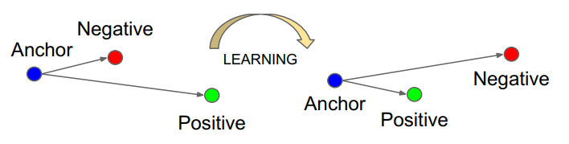
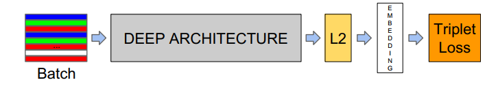

# Face Recognition

## 数据集

主要数据集可以参考以下链接，
1. [人脸识别常用数据集介绍（附下载链接）及常用评估指标](https://zhuanlan.zhihu.com/p/54811743)
2. [【数据集NO.3】人脸识别数据集汇总](https://blog.csdn.net/m0_70388905/article/details/128169372)

本次实验主要在 **CASIA-WebFace** 和 **LFW** 两种数据集上开展，其中 **CASIA-WebFace** 为预训练数据集，**LFW** 为下游微调数据集。

**CASIA-WebFace**：dong.yi, zlei, scliao等提出了一种半自动的方式来收集来自互联网的人脸图像，并建立一个大型数据集包含10575个主题和494414个图像，称为CASIA WebFACTS。CASIA-webface数据库，压缩包有4个多g，里面包含了10000个人，一共50万张人脸图片，无论是做SVM，DNN还是别的训练，都是非常好的数据库。

下载地址为：https://drive.google.com/file/d/1Of_EVz-yHV7QVWQGihYfvtny9Ne8qXVz/view

**LFW**：是目前人脸识别的常用测试集，其中提供的人脸图片均来源于生活中的自然场景，因此识别难度会增大，尤其由于多姿态、光照、表情、年龄、遮挡等因素影响导致即使同一人的照片差别也很大。并且有些照片中可能不止一个人脸出现，对这些多人脸图像仅选择中心坐标的人脸作为目标，其他区域的视为背景干扰。LFW数据集共有13233张人脸图像，每张图像均给出对应的人名，共有5749人，且绝大部分人仅有一张图片。每张图片的尺寸为250X250，绝大部分为彩色图像，也存在少许黑白人脸图片。

下载地址为：http://vis-www.cs.umass.edu/lfw/

-----

## 模型

### 机器学习
#### PCA + KNN
1111

#### PCA + SVM
2222

### 深度学习

本次实验在 FaceNet 的基础上开展，FaceNet(FaceNet: A Unified Embedding for Face Recognition and Clustering)是谷歌的一篇关于人脸识别的研究工作。

#### 1. FaceNet 相关介绍
FaceNet是一个神经网络，将人脸编码成 $ R^{128} $的向量。通过比较两张人脸得到的人脸向量，从而判定两张人脸是否属于同一人。

FaceNet定义了三分类的损失函数(triplet loss function)用于人脸识别，在训练时，包含三张人脸数据，第一张人脸数据为原始数据，第二张为同一张人脸的不同角度数据，第三张为不同的人脸数据。在训练时，让类内的同一人脸尽可能地相似（即类内间距离小），不同类别的人脸尽可能地不同（即类间距离大）。如图所示，通过学习后，正样本对距离更近，负样本对距离更远。

#### 2. Facenet 网络架构
Facenet的网络架构如图所示，输入的图片通过 Deep Architecture 之后输出一个人脸向量，用于表征当前人脸的特征。同时按照上述方法计算三分类损失，用于模型的训练。本次实验中采用的 Deep Architecture 主要有  Resnet 和 Mobinet 

##### 2.1 Resnet

Resnet 相关介绍...

##### 2.2 

Mobinet 相关介绍

#### Resnet 迁移

#### Mobinet 迁移

-----

## 参考 Reference

1. [基于ResNet迁移学习的LFW人脸识别分类](https://blog.csdn.net/qq_35434892/article/details/109697219)
2. [Labeled Faces in the Wild](http://vis-www.cs.umass.edu/lfw/)
3. [Learning Face Representation from Scratch](https://www.arxiv-vanity.com/papers/1411.7923/)
4. [FaceNet: A Unified Embedding for Face Recognition and Clustering](https://arxiv.org/abs/1503.03832)
5. [facenet](https://github.com/davidsandberg/facenet)
6. [facenet-pytorch](https://github.com/timesler/facenet-pytorch)
